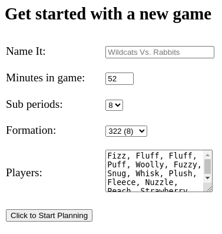
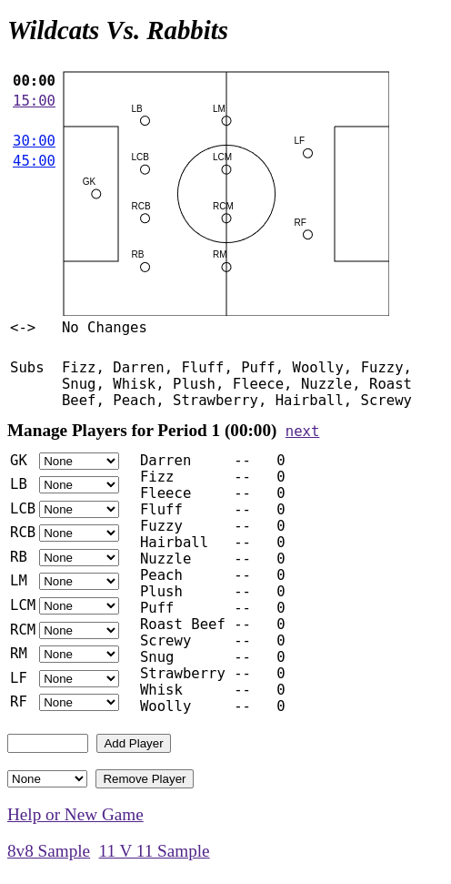
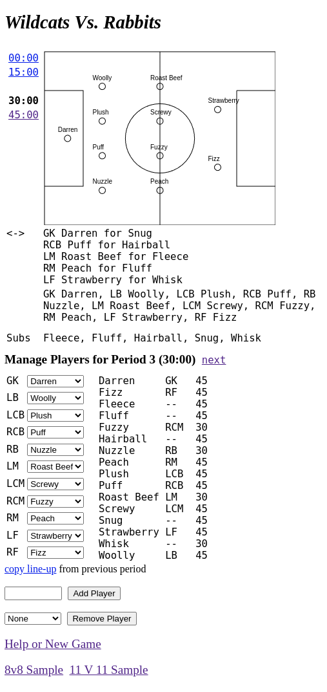

# *CheetahTS*

## The Youth Soccer Sub Planner

This is an small, open source, web app that anyone can use to plan their soccer team's substitution schedule.

The app was made to work well in a browser and on a phone at game-time. Every change is stored in the URL so all you have to do to save the game is bookmark the (very long) url!

[Use it here](https://bballant.github.io/cheetahts/).

## Getting Started

On [The CheetahTS app](https://bballant.github.io/cheetahts/), you can create a new game by filling out the small form. It will initialize the game and bring you to the main app.

In the main app, you can modify the line-up for each time period. All changes are automatically saved in the URL. Bookmark or Copy and Paste the big URL to save your game. It's possible that extremely long player names will cause the URL to be too long for some ancient browsers or the web server and cause a computer to explode.

_Here is a screenshot of the form:_

_After filling out the form, you'll end up on a page like this:_

_And after planning the game, you might end up on a page like this:_

In this sample, we are looking at the third sub period. The names of the current line-up appear in the field image. A list of changes shows, for example, that Darren replaced Snug for goalkeeper. We can see a list of subs. Below that is an area that lets us manage the player positions and add and remove players.

### The Tool Explained

* **Period Links** On the left, you have links to different sub periods. In this example, we have 4, 15-minute sub periods.
* **The Field** This shows the current line-up on an image of the field.
* **The changes <-> section** This lists specific substitutions which make it easy to tell your players who they should be calling out when they run on the field.
* **Positions and Subs** Just below the changes, we list the positions of the players and the list of Subs for the current period.
* **Manage Players** The header here has a little link to go to the next period. Below this is where you assign or re-assign players to positions. As you make changes, they will be stored in the URL so it's impossible to lose you work. You can always use the back button or browser history to find a previous game state.
* **Players and Minutes** This is the section to the right of the Manage Players section and it lists all the players, their current position, and the total game minutes they are scheduled to play.
* **Add Player** Type a name in there and click the button and that player will be added to the subs list.
* **Remove Player** Select a player to remove. Stuff happens!
* **Help or New  Game** This Link brings you back to the index page with the introductory text and a form.
